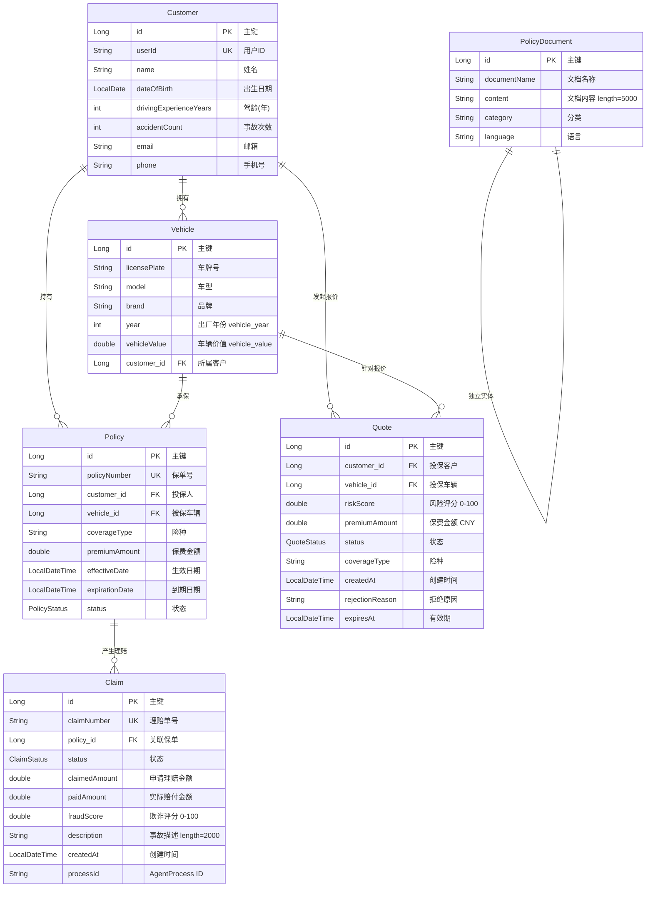

# 核心实体 ER 图

## 关系说明

| 关系 | 基数 | FK | 说明 |
|------|------|-----|------|
| Customer → Vehicle | 1:N | `customer_id` | 一个客户可拥有多辆车 |
| Customer → Policy | 1:N | `customer_id` | 一个客户可持有多份保单 |
| Customer → Quote | 1:N | `customer_id` | 一个客户可发起多次报价 |
| Vehicle → Policy | 1:N | `vehicle_id` | 一辆车可关联多份保单（续保/换险种） |
| Vehicle → Quote | 1:N | `vehicle_id` | 一辆车可对应多次报价 |
| Policy → Claim | 1:N | `policy_id` | 一份保单可产生多次理赔 |
| PolicyDocument | — | — | 独立的知识库文档，无 FK 关联 |

## 字段中文注释对照

### Customer 客户
| 字段 | 中文 |
|------|------|
| id | 主键 |
| userId | 用户ID |
| name | 姓名 |
| dateOfBirth | 出生日期 |
| drivingExperienceYears | 驾龄(年) |
| accidentCount | 事故次数 |
| email | 邮箱 |
| phone | 手机号 |

### Vehicle 车辆
| 字段 | 中文 |
|------|------|
| id | 主键 |
| licensePlate | 车牌号 |
| model | 车型 |
| brand | 品牌 |
| year | 出厂年份 |
| vehicleValue | 车辆价值 |
| customer_id | 所属客户(FK) |

### Policy 保单
| 字段 | 中文 |
|------|------|
| id | 主键 |
| policyNumber | 保单号 |
| customer_id | 投保人(FK) |
| vehicle_id | 被保车辆(FK) |
| coverageType | 险种 |
| premiumAmount | 保费金额 |
| effectiveDate | 生效日期 |
| expirationDate | 到期日期 |
| status | 状态 |

### Quote 报价单
| 字段 | 中文 |
|------|------|
| id | 主键 |
| customer_id | 投保客户(FK) |
| vehicle_id | 投保车辆(FK) |
| riskScore | 风险评分 [0-100] |
| premiumAmount | 保费金额 |
| status | 状态 |
| coverageType | 险种 |
| createdAt | 创建时间 |
| rejectionReason | 拒绝原因 |
| expiresAt | 有效期 |

### Claim 理赔单
| 字段 | 中文 |
|------|------|
| id | 主键 |
| claimNumber | 理赔单号 |
| policy_id | 关联保单(FK) |
| status | 状态 |
| claimedAmount | 申请理赔金额 |
| paidAmount | 实际赔付金额 |
| fraudScore | 欺诈评分 [0-100] |
| description | 事故描述 |
| createdAt | 创建时间 |
| processId | AgentProcess ID |

### PolicyDocument 知识库文档
| 字段 | 中文 |
|------|------|
| id | 主键 |
| documentName | 文档名称 |
| content | 文档内容 |
| category | 分类 |
| language | 语言 |
